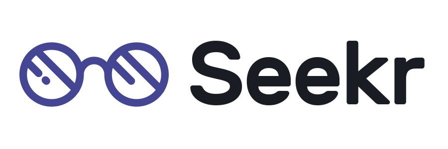

# Seekr

## What?

Seekr is a simple testing library that is for writing better tests easily and wisely on PHP. <br>Seekr is independent from any ecosystem or framework. So anyone can use it in their code.

## Why?

Because I found TDD a little hard. Behavior Driven Development sound much easier and made sense to me. So, instead of spending days to figure out how to write tests, how to integrate them with my existing code, how to set up a "build pipeline" ; I created a simple and minimalistic PHP testing library to write more accurate, efficient tests in my code.

## How?

Simple. Create a class for your tests. Extend Seekr. <br>Write test methods and start their name with 'test', like **testFoo**, **testBar** etc.<br>Then create an instance of that class. You are ready to go! Run your test file.<br>If you want to see beautified results, we recommend using PHP CLI.

Use  `$testClass->runTests()` to run tests. <br>This will run each of your test methods and create a TestResult for each. <br>These result objects are stored in`$this->testLog` property. <br>Use  `$testClass->seeTestResults()` to see your results on CLI<br>

There are a few advanced features of Seekr. <br>If you like it, you can take a look on them too :smile:

### **It has a few components :**

- **Seekr :** The base for testable classes. Any class that extends Seekr, gets access to helper testing methods.
- **Say :** Provides useful assertions for Seekr tests. Optional to use.
- **TestResult :** An object for representing test results. This can be logged, inspected and tracked. <br>Useful abstraction :)
- **Premise :** With that, everyone can create their own premises using `Premise::propose()`. <br>A premise throws a Contradiction in case that statement is evaluated and is equal to false.<br>This is considered an exception and Seekr marks this test as a failure. Otherwise it is succeed.
- **Contradiction :** An object for representing `Premise` exceptions.

### Here is a sample :

- Create your test class. Test methods should start with "**test**". <br>When they throw an exception, Seekr will handle it :)

  ```php
  class SampleTest extends Seekr 
  {
    // This test is designed to succeed
    public function testOne()
    {
      Say::equal( 1, 1 );
    }
    
    // This test is designed to fail
    public function testTwo()
    {
      Say::equal( 1, 2 );
    }
    
    // This test is designed to succeed but takes a long time
    public function testComplicated()
    {
      Do::somethingHard();
    }
  }
  ```
  
- Run your tests

  ```php
  // This is how to use Seekr.
  $test = new SampleTest();
  $test->runTests(); // runs your tests, creates TestResult for each.
  // prints the test results in a meaningful way to developers
  $test->seeTestResults();
  ```

- Get the execution result in output, looks better if you use CLI

  ```bash
  Seekr > SampleTest.testOne() was a SUCCESS ~ in 0.000025090 seconds
  Seekr > SampleTest.testTwo() was a FAILURE ~ in 0.000018347 seconds
    (Lines: 27-30 ~ File: /home/dorkodu/code/Seekr/sample-test.php)
    Contradiction [ SAY::NOT_EQUAL ] : Not Equal
  Seekr > SampleTest.testComplicated() was a SUCCESS ~ in 1.645084601 seconds
  Seekr > SUMMARY SampleTest : 2 Success 1 Failed
  ```

### Advanced :

#### Hooks

You can implement life cycle hooks to catch up with execution steps of tests :<br>These are current life cycle hooks for a test environment :

- `setUp()` :  Called before starting to run tests in a test class
- `finish()` : Called after all tests in a test class have run
- `mountedTest()` : Called before each test of this test class is run
- `unmountedTest()` : Called before each test of this test class is run.

```php
class SampleTest extends Seekr 
{
  /**
	 * This is how to use a hook. For this we use setUp(),
	 * which will be run before starting to run tests.
   */ 
  public function setUp()
  {
    echo "This is setUp hook!";
  }
```

## Author

Doruk Dorkodu : [GitHub](https://github.com/dorukdorkodu)  | [Twitter](https://twitter.com/dorukdorkodu) | [doruk@dorkodu.com](mailto:doruk@dorkodu.com) | [dorkodu.com](https://dorkodu.com)

See also the list of [contributions](https://libre.dorkodu.com) that we are making at [Dorkodu](dorkodu.com) to the free software community.

## License

Seekr is open-sourced software licensed under the [MIT license](LICENSE).

